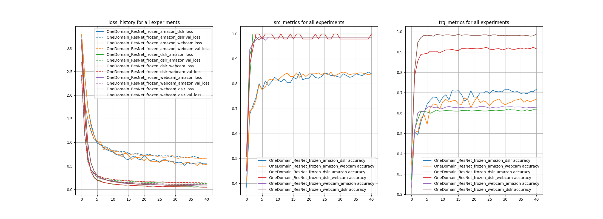
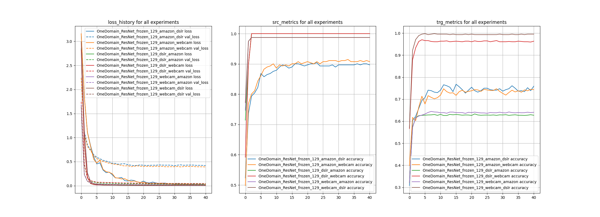
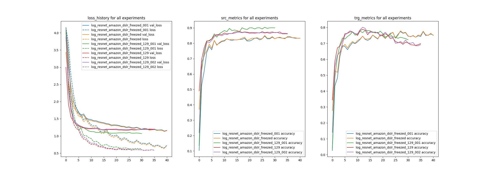
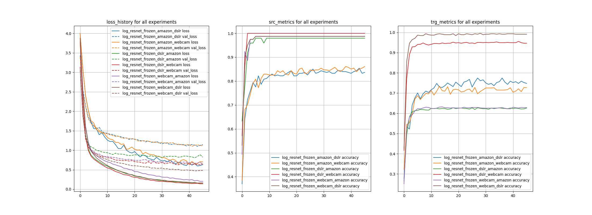
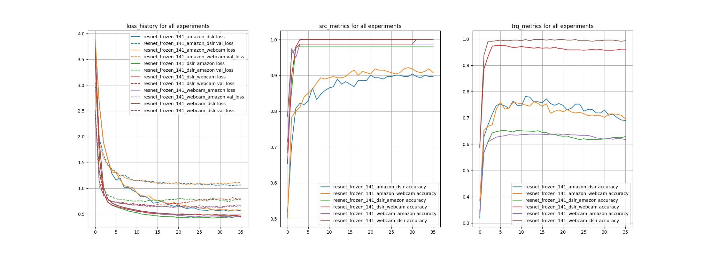

Я провела эксперименты с DANN на ResNet, чтобы понять, насколько лучше он работает, чем DANN на Alexnet, и насколько сопоставимо с результатами из обзора архитектур.
Я обучалась на полном target датасете и считала метрики на валидации по нему же. В таблицу добавляла лучшее значение метрики за время обучения. 

Если разбить target на 0.9/0.1 и выбирать лучшую модель по валидационной части, результаты практически не меняются (проверила на примерах). 

**Обучение baseline**
Я обучила машину OneHeadModel (DANN на ResNet без доменного классификатора) со всеми замороженными слоями и с 129 замороженными слоями, чтобы получить baseline и оценить, насколько добавление доменного loss улучшает результат.

* sgd, lr=0.01, все слои backbone заморожены

* sgd, lr=0.01, backbone заморожен до 129 слоя

Модель с размороженными последними слоями стабильно показывает лучшее качество.

**Заморозка слоев**

Сначала просто сравнила, как на доменах Amazon -> DSLR учится модель, и насколько на нее влияет разморозка последних слоев.
Использовала sgd, lr=0.01.

Кажестся, что модель с замороженными слоями более стабильна, но модели с размороженными последними слоями учатся гораздо быстрее. 

**Learning rate**

Поняв, что при разморозке слоев модель начинает быстро терять качество на target, хотя loss продолжаает падать, я подумала, что можно поэкспериментировать с learning rate.

Learning rate не особо влияет. Или надо было больше его менять.

*Нужно будет еще провести эксперимент с обучением модели с замороженной backbone, разморозкой и дообучением на маленьком lr.*

*И, возможно, попрбовать увеличить вес доменного loss, если первое не поможет.*

**Оценка качества на всех доменах**
Далее я решила проверить качество модели на всех доменах.

* sgd, lr=0.01, все слои backbone заморожены

* sgd, lr=0.01, backbone заморожен до 141 слоя

* sgd, lr=0.01, backbone заморожен до 129 слоя

DANN_with_resnet_frozen

Model | A → W | D→ W | W→ D	| A→ D | D → A | W→ A 
--- | --- | --- | --- | --- | --- | --- |
DANN Alexnet Статья | 0.73 |	0.964 | 0.992||||
DANN Resnet Обзор | 0.826 | 0.978 | 1 | 0.833 | 0.668	| 0.661 |
OneDomain ResNet Frozen | 0.67839 |	0.92318 | 0.98884 | 0.71652 | 0.62003 | 0.63388 |
OneDomain ResNet Frozen 129 | 0.74740 |	0.97005 | 0.99777 | 0.76786 | 0.63317 | **0.64453** |
DANN Resnet Frozen | 0.73438 | 0.95573 | 0.99554 | 0.77455 | 0.62749 | 0.63175 |
DANN Resnet Frozen 141 | 0.76172 | 0.97526 | 0.99777 | **0.78125** | 0.65270 | *0.63849* |
DANN Resnet Frozen 129 | **0.76693** | **`0.98307`** | **`1.0`** | 0.77679 | **`0.65554`** | *0.63849* |

**Жирным** выделила лучшие результаты из моих экспериментов. 
`Так` выделила результаты, которые сильно близки (не более, чем на 0.02) к результатам авторов обзора, которые прикрутили ResNet к DANN. 
Наибольшее отставание по качеству для source - amazon.

Разморозка слоев работает, но есть проблема, что качество на target начинает падать, пока качество на source растет. Видимо, если потюнить что-нибудь в loss можно добиться лучшего результата. 
 